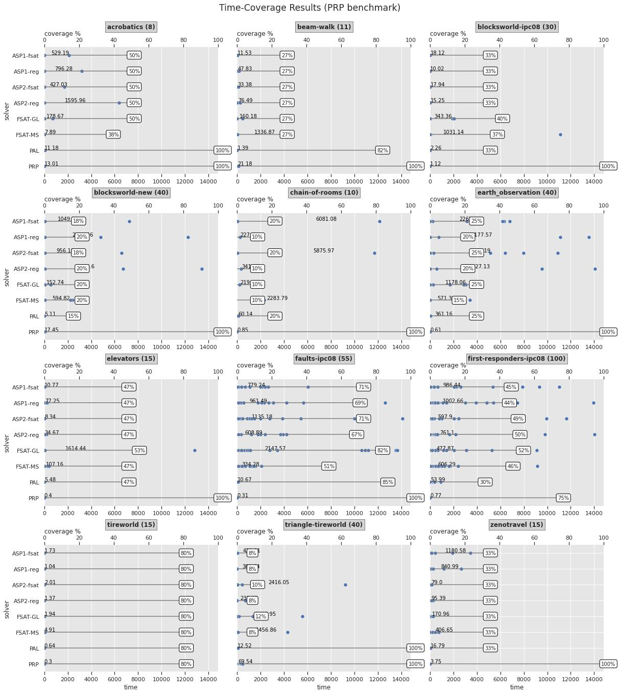
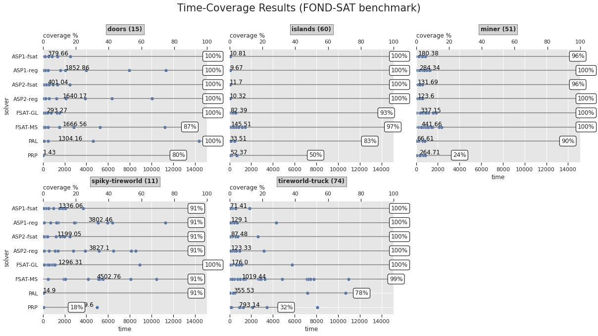

# CFOND-ASP: A Declarative Approach to Compact Controllers for FOND Planning via Answer Set Programming

CFOND-ASP is a FOND planner based on Answer Set Programming that computes compact controller solutions. It was inspired by a synthesis between [FOND-SAT](https://github.com/tomsons22/FOND-SAT) and [PRP](https://github.com/QuMuLab/planner-for-relevant-policies) planners.

The planner and its underlying technique were reported in the following paper:

* Nitin Yadav, Sebastian Sardiña: [A Declarative Approach to Compact Controllers for FOND Planning via Answer Set Programming](https://doi.org/10.3233/FAIA230593). ECAI 2023: 2818-2825

The `benchmarks/` folder contains problem instances, while folder `experiments/` contains the experimental framework; see [`README.md`](experiments/README.md) in that folder for more information.

- [CFOND-ASP: A Declarative Approach to Compact Controllers for FOND Planning via Answer Set Programming](#cfond-asp-a-declarative-approach-to-compact-controllers-for-fond-planning-via-answer-set-programming)
  - [Requirements](#requirements)
  - [Install](#install)
    - [SAS translator setup](#sas-translator-setup)
  - [Usage](#usage)
    - [Solver configurations available](#solver-configurations-available)
    - [Clingo parameters](#clingo-parameters)
    - [Verification of controller](#verification-of-controller)
  - [Extension features](#extension-features)
    - [Use backbone for minimum controller size estimation](#use-backbone-for-minimum-controller-size-estimation)
    - [Use domain knowledge](#use-domain-knowledge)
  - [Experiments](#experiments)
  - [Contributors](#contributors)

## Requirements

The following software need to be available:

- Python 3.11+ with dependencies as per `requirements.txt`.
- [Clingo](https://potassco.org/clingo/) 5.5+ ASP solver.
  - Note version 5.4 does not support chained comparisons used of the form `X < Y < Z`.
- Patched version of [SAS Translator](https://www.fast-downward.org/TranslatorOutputFormat) from [downward library](https://github.com/aibasel/downward). A minor patch needs to be applied to handle FOND problems; see below for how to do this. This will produce a [SAS encoding]([SAS encoding](https://www.fast-downward.org/TranslatorOutputFormat)) of a problem instance.
  - This tool translates a deterministic PDDL domain and problem to an (optimized) SAS encoding. Note only the Python-based translator is used by CFOND-ASP.
  - Current version tested: Jan 15, 2024 version at commit [3c8a65b](https://github.com/aibasel/downward/tree/3c8a65b5d54da8db50378d66b806b34b07357f35).

> [!NOTE]
> Previous version (before January 2025) of the planner did the determinization and SAS translator all at once, using the extended FOND translator in [translate-allout](https://github.com/ssardina-research/translator-fond/tree/main/translate-allout) script. Such translator was a modification of [Fast-downard release 22.12](https://github.com/aibasel/downward/tree/release-22.12.0) (December 16, 2022) SAS translator, extended to also implement the FOND all-outcome determinization. Note this is a different from the one used in the [2011 PRP](https://github.com/ssardina-research/translator-fond/releases/tag/2011-prp) planner: it is much updated and includes fixes to handle no-op actions correctly (i.e., without simplifying them).
>
> From January 2025, the planner has decoupled determinization (now via [fond-utils](https://github.com/AI-Planning/fond-utils) library at the PDDL level) from SAS translation encoding, so that the standard SAS translator from downward library can be used against the already determinized PDDL model.

## Install

The planner is distributed as a package and can then be installed via pip directly.

One can also install it from the repo itself:

```shell
$ pip install git+https://github.com/ssardina-research/cfond-asp
```

Alternatively, one can clone first and install the planner:

```shell
$ git clone https://github.com/ssardina-research/cfond-asp
$ cd cfond-asp
$ pip install .
```

> [!TIP]
> If you plan to develop on CFOND-ASP it can be useful to install the cloned repo as [editable project](https://setuptools.pypa.io/en/latest/userguide/development_mode.html) via `pip install -e .`

Once installed, the planner is available via its CLI interface:

```shell
$ cfond-asp -h
usage: cfond-asp [-h] [--max_states MAX_STATES] [--min_states MIN_STATES] [--inc_states INC_STATES]
                 [--timeout TIMEOUT]
                 [--model {fondsat,regression,strong}] [--clingo_args CLINGO_ARGS] [--extra_constraints EXTRA_CONSTRAINTS]
                 [--filter_undo] [--use_backbone] [--domain_kb {triangle-tireworld,miner,acrobatics,spikytireworld}]
                 [--dump_cntrl] [--output OUTPUT]
                 domain problem

CFOND-ASP: A FOND planner for compact controllers via ASP. - Version: 0.1.5

positional arguments:
  domain                Domain PDDL file
  problem               Problem PDDL file
```

### SAS translator setup

The CFOND-ASP planner requires the SAS translator (adapted for FOND) to be available.  It is the resulting [SAS encoding](https://www.fast-downward.org/TranslatorOutputFormat) what is actually translated into an ASP problem.

By default, the planner will assume the binary `translate.py` is in the path, but its specific path can be set via `--translator-path` option.

The SAS translator used is a modified version of the classical SAS translator shipped with [downward](https://github.com/aibasel/downward) planning framework (located under [src/translate](https://github.com/aibasel/downward/tree/main/src/translate). The minor modification done to such translation involves always keeping (never simplifying) any action that resulted from the determinization of a FOND planning domain. The planner determinizes a FOND domain using the [fond-utils]([fond-utils](https://github.com/AI-Planning/fond-utils)) and annotates every resulting operator from a determinization with the suffix `DETUP` which are always kept by the modified translator, even if they end up being trivial no-op actions.

There are two ways to obtain the modified translator. The simplest way is to get it from the [translator-fond](https://github.com/ssardina-research/translator-fond) repo (under `translate/` folder).

The second way is to get the `src/translate` folder from [downward](https://github.com/aibasel/downward) and apply the corresponding patch:

```shell
$ wget https://github.com/aibasel/downward/archive/refs/tags/release-24.06.0.zip
$ wget https://raw.githubusercontent.com/ssardina-research/translator-fond/refs/heads/main/translate/translate-fond-3c8a65b.patch

$ unzip release-24.06.0.zip

# apply patch to classical SAS translator
$ patch --directory=./downward-release-24.06.0/src/translate --strip=1 <  translate-fond-3c8a65b.patch
patching file pddl/actions.py
patching file pddl_parser/parsing_functions.py
patching file simplify.py
patching file translate.py
patching file variable_order.py

# optional: make translate.py available in the path
$ export PATH=$PATH:$PWD/downward-release-24.06.0/src/translate/
```

Otherwise, specify the full path to `translate.py` using `--translator-path` option when running the planner.

## Usage

The planner is offered as a binary application:

```shell
$ cfond-asp [options] fond_domain fond_problem
```

Use `-h` to get all options available.

Note this is equivalent to cloning the planner repo and from tis root folder execute:

```shell
$ python -m cfondasp [options] fond_domain fond_problem
 ```

> [!WARNING]
> The above assumes the SAS translator is accessible in the path system-wide. In most cases you may want to explicitly specify it via option `--translator-path`, e.g., `--translator-path $HOME/downward/src/translate/translate.py`

The planner main script parses the input and solves the planning instance as follows:

1. Computes the all-outcome determinization of the FOND domain using [fond-utils](https://github.com/AI-Planning/fond-utils) project.
2. Translates (and grounds) the now deterministic all-outcome domain and problem instance to [SAS](https://www.fast-downward.org/TranslatorOutputFormat) encoding using the translator from [Fast-Downward](https://www.fast-downward.org/) available in [translator-fond](https://github.com/ssardina-research/translator-fond) repo.
3. Performs the encoding of the SAS file to a ASP file `instance.lp`. This follows the [ECAI23 paper](https://doi.org/10.3233/FAIA230593) technique.
4. Calls Clingo ASP solver with `instance.lp` and the chosen ASP planning solver model (and possibly other additional clingo files as needed).

Resulting output files will be left in the corresponding output directory (`./output` by default), including Clingo output for each iteration (wrt controller size), SAS encoding and output, ASP instance used, and stat file.

For example to solve the `p03.pddl` problem from the `Acrobatics` domain:

```shell
$ cfond-asp benchmarks/acrobatics/domain.pddl benchmarks/acrobatics/p03.pddl --translator-path ~/planners/downward/src/translate/translate.py

2025-01-16 15:26:43 surface FondASP[1848420] INFO Solving benchmarks/acrobatics/domain.pddl with problem benchmarks/acrobatics/p03.pddl using backbone=False.
2025-01-16 15:26:43 surface FondASP[1848420] INFO  -Solving with numStates=1.
2025-01-16 15:26:43 surface FondASP[1848420] INFO  -Solving with numStates=2.
2025-01-16 15:26:43 surface FondASP[1848420] INFO  -Solving with numStates=3.
2025-01-16 15:26:43 surface FondASP[1848420] INFO  -Solving with numStates=4.
2025-01-16 15:26:43 surface FondASP[1848420] INFO  -Solving with numStates=5.
2025-01-16 15:26:43 surface FondASP[1848420] INFO  -Solving with numStates=6.
2025-01-16 15:26:43 surface FondASP[1848420] INFO  -Solving with numStates=7.
2025-01-16 15:26:43 surface FondASP[1848420] INFO  -Solving with numStates=8.
2025-01-16 15:26:43 surface FondASP[1848420] INFO  -Solving with numStates=9.
2025-01-16 15:26:44 surface FondASP[1848420] INFO  -Solving with numStates=10.
2025-01-16 15:26:44 surface FondASP[1848420] INFO  -Solving with numStates=11.
2025-01-16 15:26:44 surface FondASP[1848420] INFO  -Solving with numStates=12.
2025-01-16 15:26:44 surface FondASP[1848420] INFO  -Solving with numStates=13.
2025-01-16 15:26:45 surface FondASP[1848420] INFO  -Solving with numStates=14.
2025-01-16 15:26:45 surface FondASP[1848420] INFO  -Solving with numStates=15.
2025-01-16 15:26:46 surface FondASP[1848420] INFO Solution found for instance (benchmarks/acrobatics/domain.pddl, acrobatics/p03.pddl)!
2025-01-16 15:26:46 surface FondASP[1848420] INFO Number of states in controller: 16
2025-01-16 15:26:46 surface cfondasp.__main__[1848420] WARNING Time taken: 2.9394077729957644
```

Use `--dump_cntrl` to dump controller found, if any, into text and JSON formats.

### Solver configurations available

The available ASP solver configurations can be chosen via `--model` option and can be found under folder [cfondasp/asp/](cfondasp/asp/) as ASP Clingo programs.

The default solve model is for strong-cyclic solutions via the `fondsat` type encoding. Other models include:

- `controller-fondsat`: strong-cyclic encoding following FONDSAT in propagating negative propositions forward.
- `controller-reg`: strong-cyclic encoding implementing weakest-precondition via regression (like PRP).
- `strong`: strong solutions.

### Clingo parameters

To pass specific argument to Clingo use `--clingo_args` as a quoted string. For example, to tell Clingo to use 4 threads and tell Clingo this is a single-shot task:

```shell
$ cfond-asp benchmarks/acrobatics/domain.pddl benchmarks/acrobatics/p03.pddl --clingo-args '-t 4 --single-shot'

...
2024-01-12 15:05:45 nitin FondASP[195707] INFO Solution found for id benchmarks/acrobatics/domain.pddl, benchmarks/acrobatics/p03.pddl!
2024-01-12 15:05:45 nitin __main__[195707] INFO Time(s) taken:1.3016068750002887
```

### Verification of controller

To _verify_ a solution already computed, use the `cfond-asp-verify` tool:

```shell
$ cfond-asp-verify output
Namespace(output_dir='/home/ssardina/PROJECTS/planning/FOND/cfond-asp/cfond-asp-private.git/output')
2025-01-20 23:16:53 surface FondASP[4154414] INFO Solution is sound? True
2025-01-20 23:16:53 surface cfondasp.__verify__[4154414] DEBUG Output folder: /home/ssardina/PROJECTS/planning/FOND/cfond-asp/cfond-asp-private.git/output
2025-01-20 23:16:53 surface cfondasp.__verify__[4154414] WARNING Time taken: 0.0032609630143269897
```

If not installed as a package, this is equivalent to calling:

```shell
$ python -m cfondasp.__verify__ output
Namespace(output_dir='/home/ssardina/PROJECTS/planning/FOND/cfond-asp/cfond-asp-private.git/output')
2025-01-21 07:25:39 surface FondASP[4172347] INFO Solution is sound? True
2025-01-21 07:25:39 surface __main__[4172347] DEBUG Output folder: /home/ssardina/PROJECTS/planning/FOND/cfond-asp/cfond-asp-private.git/output
2025-01-21 07:25:39 surface __main__[4172347] WARNING Time taken: 0.01352302695158869
```

This will first translate Clingo output to a readable controller format (see the file `controller.out` in the output directory), and then check the controller found is indeed strong-cyclic.

Verification result will be saved in file `verify.out`.

## Extension features

The ECAI23 paper reports two optimisations: the use of weak-plan backbones and the usef of control domain knolwedge.

### Use backbone for minimum controller size estimation

To use _backbone_ size estimation (a lower bound on the size of the controller) to reduce the number of iterations, use `--use-backbone` option:

```shell
$ cfond-asp benchmarks/acrobatics/domain.pddl benchmarks/acrobatics/p03.pddl  --use-backbone

...
2024-01-12 15:06:35 nitin FondASP[195939] INFO Solution found for id benchmarks/acrobatics/domain.pddl, benchmarks/acrobatics/p03.pddl!
2024-01-12 15:06:35 nitin __main__[195939] INFO Time(s) taken:1.2567479549907148
```

### Use domain knowledge

One can incorporate additional domain (control) knowledge in the planner by specifying additional ASP code, usually integrity constraints forbidding certain situations, and use option `--extra-constraints`.

For example, to tell the planner to completely _exclude_ action `jump` in the `Acrobatics` domain, we create a new file with the following ASP constraint:

```prolog
:- policy(State, Action), state(State), actionType("jump-over", Action).
```

If the file is called `acrobatics.lp`, one can then run the planner with option `--extra-constraints`:

```shell
$ cfond-asp benchmarks/acrobatics/domain.pddl benchmarks/acrobatics/p03.pddl  --clingo-args '-t 4' --use-backbone --extra-constraints ./acrobatics.lp

...
Solution found for id /home/nitin/Work/Software/cfond-asp/benchmarks/acrobatics/domain.pddl, /home/nitin/Work/Software/cfond-asp/benchmarks/acrobatics/p03.pddl!
2024-01-12 15:15:58 nitin __main__[198321] INFO Time(s) taken:0.9603760419995524
```

## Experiments

The set of experiments in ECAI23 paper were re-done using the [Benchexec](https://github.com/sosy-lab/benchexec) framework. Details can be found under [experiments/](experiments/README.md).

Two more configurations of the planner were added, using the FOND-SAT forward propagation of atoms (`ASP1-fsat` and `ASP2-fsat`) besides the regression-based configurations (`ASP1-reg` and `ASP2-reg`):





## Contributors

- Nitin Yadav (nitin.yadav@unimelb.edu.au)
- Sebastian Sardina (ssardina@gmail.com - sebastian.sardina@rmit.edu.au)
