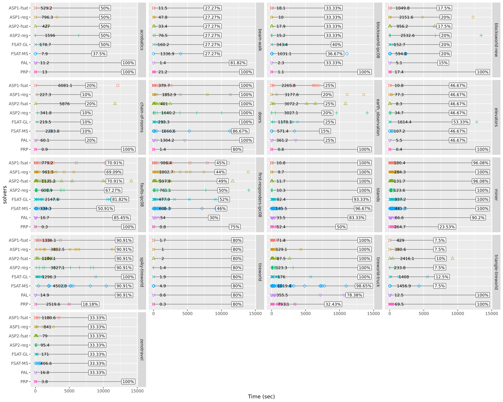

# Experiments

This folder contains all the tools to run a full experiment.

As of July 2024, experiments were re-done using the [Benchexec](https://github.com/sosy-lab/benchexec) experimental framework, which allows reliable benchmarking and resource measurement.

[Benchexec](https://github.com/sosy-lab/benchexec) is an benchmarking framework that is able to reliably measure and limit resource usage of the benchmarked tool even if the latter spawns sub-processes. It also includes a program called [runexec](https://github.com/sosy-lab/benchexec/blob/main/doc/runexec.md) that _"can be used to easily execute a single command while measuring its resource consumption, similarly to the tool time but with more reliable time measurements and with measurement of memory usage"_.


- [Experiments](#experiments)
  - [Installation and setup](#installation-and-setup)
  - [Configuring an experiment benchmark: Tools + Tasks](#configuring-an-experiment-benchmark-tools--tasks)
  - [Running a benchmark experiment](#running-a-benchmark-experiment)
    - [Setting environment variables](#setting-environment-variables)
    - [Running an experiment](#running-an-experiment)
    - [Output of benchexec](#output-of-benchexec)
    - [Runexec tool: single benchexec runs](#runexec-tool-single-benchexec-runs)
  - [Example under NECTAR cluster](#example-under-nectar-cluster)
    - [Genearte coverage plots](#genearte-coverage-plots)

## Installation and setup

Details on its installation and its working can be found [here](https://github.com/sosy-lab/benchexec/blob/main/doc/INSTALL.md). Please note that Benchexec works better with Linux kernel 6.1+.

The recommneded instructions for Ubuntu-based system is to install Benchexec from its [PPA](https://launchpad.net/~sosy-lab/+archive/ubuntu/benchmarking) system-wide:

```shell
$ sudo add-apt-repository ppa:sosy-lab/benchmarking
$ sudo apt update
$ sudo apt install Benchexec
...
The following additional packages will be installed:                       
  python3-coloredlogs python3-humanfriendly python3-pystemd            
Recommended packages:                                                                     
  cpu-energy-meter fuse-overlayfs                                                         
The following NEW packages will be installed:                  
  benchexec python3-coloredlogs python3-humanfriendly python3-pystemd 
```

As you can see, this will automatically install three more packages, including `python3-pystemd` that will set-up cgroups automatically. By doing this the benchexec package should be available system-wide and from all Python virtual environments used (check [this explanation](https://medium.com/@sachinsoni600517/how-python-search-for-imported-module-package-76cf0da5f690)).

After that, _create a virtual environment_ sandbox for the project, for example using `venv` we create it inside the main project folder `/mnt/projects/fondasp`:

```shell
# create virtual environment in project folder
$ python -m venv /mnt/projects/fondasp/cfond-p10

# activate virtual environment
$ source /mnt/projects/fondasp/cfond-p10/bin/activate
```

Next, we install CFOND-ASP planner in the just created environment as a package:

```shell
$ pip install git+https://github.com/ssardina-research/cfond-asp
```

This will make the CFOND-ASP binary (`cfond-asp`) available.

> [!TIP]
> If you need a new install of Python (beyond just a virtual environment), consider using [pyenv](https://github.com/pyenv/pyenv) which will allow you to localy install any Python version and corresponding virtual environments.

## Configuring an experiment benchmark: Tools + Tasks

The above has set-up Benchexec and the planner CFOND-ASP. We assume we  the virtual environment created is active, that we have already cloned the CFOND-ASP repo somewhere (in our NecTAR setup, it is in `/mnt/projects/fondasp/cfond-asp.git`). The experimental framework for Benchexec is located in folder `experiments/benchexec`.

To benchmark a particular solver (possibly under different settings/configurations), we provide:

1. A **solver tool** Python script, defining the solver that will be benchmarked. This includes the executable of the solver and the processing of its output (e.g., to extract policy size).
   * Tool definitions for the solvers used can be found under [benchexec/tools](benchexec/tools).
2. A set of **tasks** defining each instance to be solved, as an YAML file specifying input files (domain and problem) and output folder.
   * Tasks for the plannig problems instances in the planner `benchmark/` folder can be found under [benchexec/tasks](benchexec/tasks/).
   * These tasks have been generated automatically using script [benchexe/gen_tasks.py](benchexec/gen_tasks.py). From `experiments/` folder:

      ```shell
      $ python benchexec/gen_tasks.py ../benchmarks benchexec/ --prefix ../../benchmarks
      ```

      This will add all the `.yml` task files into folder `benchexec/tasks`, using benchmark folder `../benchmarks` and input files will be prefixed with path `../../

3. A main **benchmark definition**, as an XML file, defining solver tool, resource limits, tasks to run, and run definitions. One creates one XML file per tool.
   * Benchmark definition XML files can be found under [`benchexec/`](benchexec/).
   * Note that most XML files define various runs definition, for the same solver under different configurations.

More explanation on this can be found [here](https://github.com/sosy-lab/benchexec/blob/main/doc/benchexec.md) and definition of other terms can be found in the [Glossary](https://github.com/sosy-lab/benchexec/blob/main/doc/INDEX.md).

> [!NOTE]
> The experiments provided uses the benchmark set shiped with the CFOND-ASP planner. A more "official" and comprehensive set of FOND planning problems can be found in repo [AI-Planning/fond-domains/](https://github.com/AI-Planning/fond-domains/).

## Running a benchmark experiment

We assume we are in a folder where we want the data of Benchexec to be left, and that the project Python environment as above is active.

In our example, we are in folder `/mnt/data/fondasp/benchexec-exp`.

### Setting environment variables

We first need to make sure the various _tool_ Python modules/classes (as used in the XML benchmark definitions) are available. This can be done by changing variable [PYTHONPATH](https://docs.python.org/3/using/cmdline.html#envvar-PYTHONPATH) so that module `benchexec` can be found by Python (note that we are in a folder different from the CFOND-ASP local copy, so need to give the full path):

```shell
$ export PYTHONPATH=/mnt/projects/fondasp/cfond-asp-private.git/experiments/benchexec/
```

Second, we need to make sure that Benchexec has access to all binaries used by the various tools (e.g., planning systems). One way is to make all those tools available in the `PATH`, but this can be cumbersome. A cleaner way is to setup a `bin/` folder containing symbolic links to all the solver binaries used and then use option `--tool-directory` (see below), which tells Benchexec where the tools' _executables_ (e.g., the `prp` binary) are located. 

> [!NOTE]
> If this parameter is not given, Benchexec searches in the directories of the `PATH` environment variable and in the current directory. So an alternative is to add the `bin/` folder created in the `PATH` via `export PATH=$PATH:$PWD/bin`


>[!IMPORTANT]
> For CFOND-ASP, its corresponding tool `cfondasp.py` assumes the planner has been installed as a package and hence the binary `cfond-asp` available in the Python virtual environment. The name of the binary for the other solvers can be found in function `executable` of each tool definition. We have already installed the planner above in the current virtual environment.

Finally, make sure the [SAS translator for FOND](https://github.com/ssardina-research/translator-fond/tree/main/translate) is available in the `PATH`, either by setting a symbolic link to `translate.py` under the above `bin/` folder or adding it to the path:

```shell
$ export PATH=$PATH:/path/to/translator-fond/translate/translate/translate.py
```

At this point the Benchexec framework has access to the Python tool modules, the tool executable themselves, and the SAS translator for FOND.

### Running an experiment

To benchmark a solver one passes the main benchmark definition XML file with the required arguments.

For example, the command below runs the PRP tool on 3 problems in parallel (`-N 3`) with one core per problem (`-c 1`):

```shell
$ benchexec /path/to/cfondasp/experiments/benchexec/benchmark-prp.xml -t test -N 3 -c 1 --tool-directory ./bin --read-only-dir / --overlay-dir /home
executing run set 'prp.FOND'     (9 files)
17:54:06   starting   blocksworld-ipc08_01.yml
17:54:06   starting   blocksworld-ipc08_02.yml
17:54:06   starting   blocksworld-ipc08_03.yml
17:54:06              blocksworld-ipc08_02.yml    true                         0.10    0.10
17:54:06              blocksworld-ipc08_03.yml    true                         0.10    0.10
17:54:06              blocksworld-ipc08_01.yml    true                         0.10    0.10
17:54:06   starting   blocksworld-ipc08_04.yml
17:54:06   starting   blocksworld-ipc08_05.yml
17:54:06   starting   blocksworld-ipc08_06.yml
17:54:06              blocksworld-ipc08_06.yml    true                         0.11    0.11
17:54:06              blocksworld-ipc08_05.yml    true                         0.11    0.11
17:54:06   starting   blocksworld-ipc08_07.yml
17:54:06   starting   blocksworld-ipc08_08.yml
17:54:06              blocksworld-ipc08_04.yml    true                         0.12    0.12
17:54:06   starting   blocksworld-ipc08_09.yml
17:54:06              blocksworld-ipc08_07.yml    true                         0.11    0.11
17:54:06              blocksworld-ipc08_08.yml    true                         0.11    0.11
17:54:06              blocksworld-ipc08_09.yml    true                         0.12    0.12

Statistics:              9 Files
  correct:               0
    correct true:        0
    correct false:       0
  incorrect:             0
    incorrect true:      0
    incorrect false:     0
  unknown:               0

In order to get HTML and CSV tables, run
table-generator results/benchmark-prp.2024-07-20_17-54-06.results.prp.FOND.xml.bz2
```

The `---tool-directory` tells Benchexec where the tools' _executables_ (e.g., the `prp` binary) are located. If this parameter is not given, Benchexec searches in the directories of the `PATH` environment variable and in the current directory.

If you get error:

```shell
Unsupported tool "tools.prp" specified. ImportError: No module named 'tools'
```

it is because the XML definition couldn't find the tool Python module. Remember to set the environment variable `PYTHONPATH` to make sure `benchexec/tools` is found by Python.

The last three options refer to [container configurations](https://github.com/sosy-lab/benchexec/blob/main/doc/container.md#container-configuration):

* `--read-only-dir /`: allows the container to access all the file-system in read mode
* `--overlay-dir /home`: allows Benchexec to access all `/home/` as an overlay transparent file system:
  * All the existing data there is accessible for read unless it is hidden via `--hidden-dir`.
  * _New_ data/files can be written (e.g., log files of the run), but it will be done on RAMDISK and hence will be counted towards memory usage, unless `--no-tmpfs` option is used, in which case writes will go to disk and NOT counted as memory usage (note that even in this case, Linux may still write to cache memory if available! see thread discussion we had in issue [#1025](https://github.com/sosy-lab/benchexec/issues/1025)).
  * If we want to retrieve anything that is written by the execution, it has to be specified in the `<resultsfiles>` section in the XML configuration files. The retrieved files will be accessible under the Benchexec result folder (but by just a bulk copy a the end of the execution, not by writing directly there while running!).
* `--hidden-dir`: the host directory specified will be hidden in the container. This allows the process to use that directory "fresh" without clashing with whatever is already there in the host. In our case, we hide the directory where the output of the solver is meant to be located, in case such folder already exists in the host. If it does and we don't hide it, the solver will try to re-create the folder but since it does exist in the overlay in read-mode, the solver will crash with I/O error because it cannot remove a folder that is in already in the host.

By default, the container then runs in isolation, with writes to file system done in RAM memory. If we want to give the container full direct access to some part of the file-system, we can use for example `--full-access-dir /home/$USER`. Then, anything that is done under `/home/$USER` will be as if running in the host directly.

Note that the `--overlay-dir` does give access to the host file system in the container, but only on read-mode for what already exists.

**NOTE:** while in principle one should be able to use any overlay directory, it seems Benchexec creates a virtual home folder under `home/benchexec`, so it is hard-coded. See [this code](https://github.com/sosy-lab/benchexec/blob/64d73c47e05a1487727c4777e23863ce4ed4851a/benchexec/container.py#L55). So, if we give say `/home/ssardina`, Benchexec complains it cannot create such `home/benchexec`.

### Output of benchexec

Benchexec reports stats, logs, and corresponding out files for every executed run; check [here](https://github.com/sosy-lab/benchexec/blob/main/doc/run-results.md). All outputs will be placed under folder `results/` and run values are stored in files `<run name>.xml.bz2`

Refer below to understand how to extract state tables into CSV and HTML files and then process them via notebooks.

### Runexec tool: single benchexec runs

We can use the [`runexec`](https://github.com/sosy-lab/benchexec/blob/main/doc/runexec.md) tool to run a particular script/program on the spot once (i.e., without XML, tools, etc. configurations).

Some simple scripts for testing were done in the context of issue [#1025](https://github.com/sosy-lab/benchexec/issues/1025) in folder [`experiments/benchexe/benchexec-test/`](experiments/benchexe/benchexec-test/).

Script `benchexec.sh` basically writes a dummy 500MB file. Let us see how much memory it uses.

We can do a run on container (default) mode that also recovers all the output files:

```shell
$ runexec --read-only-dir / --overlay-dir /home/ --result-files "*" --memlimit 12331392  ./path-prp/prp benchmarks/beam-walk/domain.pddl benchmarks/beam-walk/p09.pddl
2024-07-20 18:44:45 - INFO - Starting command ./bin/prp benchmarks/beam-walk/domain.pddl benchmarks/beam-walk/p09.pddl
2024-07-20 18:44:45 - INFO - Writing output to output.log and result files to output.files
2024-07-20 18:44:49 - WARNING - System has swapped during benchmarking. Benchmark results are unreliable!
starttime=2024-07-20T18:44:45.368472+10:00
returnvalue=8
walltime=4.5116885360002925s
cputime=4.510404s
memory=22323200B
blkio-read=0B
blkio-write=0B
pressure-cpu-some=0.000658s
pressure-io-some=0s
pressure-memory-some=0s
```

The standard output will be saved into `output.log` and all files will be retrived into `output.files/` folder. As we can see, all resources used are reported, stating that the run took 4+ seconds and used 22323200 bytes, that is, 22MB.

If we specify a limit of 20MB, then it will fail and report memory termination:

```shell
$ runexec --read-only-dir / --overlay-dir /home/ --result-files "*" --memlimit 20000000  ./bin/prp benchmarks/beam-walk/domain.pddl benchmarks/beam-walk/p09.pddl
2024-07-20 19:08:18 - INFO - Starting command ./bin/prp benchmarks/beam-walk/domain.pddl benchmarks/beam-walk/p09.pddl
2024-07-20 19:08:18 - INFO - Writing output to output.log and result files to output.files
starttime=2024-07-20T19:08:18.170010+10:00
terminationreason=memory
exitsignal=9
walltime=0.11081427399949462s
cputime=0.112003s
memory=19996672B
blkio-read=0B
blkio-write=0B
pressure-cpu-some=0.000032s
pressure-io-some=0s
pressure-memory-some=0.000186s
```

If we use the `--no-tmpfs` option, we are telling benchexec to NOT use RAMDISK and use the actual hard drive; file writting does not count towards memory usage.


## Example under NECTAR cluster

We used the Australian [NECTAR cluster infrastructure](https://ardc.edu.au/services/ardc-nectar-research-cloud/) to run the experiments. The CPUs are as follows:

```
processor	: 31
vendor_id	: AuthenticAMD
cpu family	: 23
model		: 49
model name	: AMD EPYC-Rome Processor
stepping	: 0
```

> [!WARNING]
> While the machines have many cores, we found that running more than 8 experiments at the same time yields high-variance, non-replicable, performance. So we only run 8 tasks in parallel. See [this isue](https://github.com/ssardina-research/app/discussions/97).

Code itself is located in network drive `/mnt/projects/fondasp/cfond-asp-private.git`. 

However, we save the output dataunder local filesystem `/mnt/data/cfondasp/`, which is faster than the project folder (which is a networking device).

Let us see how to benchmark CFOND-ASP planner on Python 3.12.7 (latest on Feb 1, 2025!).

First, setup a new Python version for it via [pyenv](https://github.com/pyenv/pyenv):

```shell
# setup new Python version and install all dependencies
$ pyenv install 3.12.7  # will install fresh Python under ~/.pyenv
$ pyenv shell 3.12.7  # activate python version (all)

$ pip install git+https://github.com/ssardina-research/cfond-asp  # install cfond-asp planner
$ pip install benchexec\[systemd\]  # install benchexec package
$ which benchexec
/home/ssardina/.pyenv/shims/benchexec
```

> [!NOTE]
> Same process can be done by just creating a virtual environment with the Python available in the system 


Next, let us create a folder to store all results and get into it:

```shell
$ cd /mnt/data/fondasp/
$ mkdir cfondasp-25-02-01
$ cd cfondasp-25-02-01
```

Test CFOND-ASP is correctly installed (note how the path to the SAS translator is explicitly specified):

```shell
$ cfond-asp ~/projects/fondasp/cfond-asp-private.git/benchmarks/acrobatics/domain.pddl ~/projects/fondasp/cfond-asp-private.git/benchmarks/acrobatics/p01.pddl --translator-path /mnt/projects/fondasp/translator-fond.git/translate/translate/translate.py
```

As we can see `cfond-asp` is already available in the path.

Next, set the path for Python to find the tools used:

```shell
$ export PYTHONPATH=/mnt/projects/fondasp/cfond-asp-private.git//experiments/benchexec
```

Finally, make the SAS translator available in the path:

```shell
$ export PATH=$PATH:$HOME/projects/fondasp/translator-fond.git/translate/translate
```


$ benchexec experiments/benchexec/benchmark-fondasp.xml -N 8 -c 1 --read-only-dir / --overlay-dir /home -o /mnt/data/cfondasp/cfondasp-21-07-24
```

## Analysis of experiments

### Extract Benchexec CSV stats tables

Benchexec will leave all outputs will be placed under folder `results/`.

Importantly, you can generate CSV and HTML table from the results in files `*.<run name>.xml.bz2` for further analysis, for example via Pandas. Check how to generate these tables [HERE](https://github.com/sosy-lab/benchexec/blob/main/doc/table-generator.md).

When benchexec finishes it will print a message stating what command needs to be run to generate the standard tables:

```
In order to get HTML and CSV tables, run
table-generator results/benchmark-prp.2024-07-20_18-01-50.results.prp.test.xml.bz2
```

But it can also also be run later and on different `xml.bz2` files. The table generator will require access to the tools used so make sure you have set `PYTHONPATH` to point to where the `tools` Python module is located, for example:

```shell
$ export PYTHONPATH=$PWD/../../../benchexec/
$ echo $PYTHONPATH
/home/ssardina/PROJECTS/planning/FOND/cfond-asp/cfond-asp-private.git/experiments/stats/july24-redo-benchexec/../../benchexec/
```

The following generates the tables for the `PRP.FOND` run:

```shell
$ table-generator prp-19-07-24/benchmark-prp.2024-07-19_17-59-23.results.prp.FOND.xml.bz2
INFO:     prp-19-07-24/benchmark-prp.2024-07-19_17-59-23.results.prp.FOND.xml.bz2
INFO: Merging results...
INFO: The resulting table will have 590 rows and 6 columns (in 1 run sets).
INFO: Generating table...
INFO: Writing HTML into prp-19-07-24/benchmark-prp.2024-07-19_17-59-23.results.prp.FOND.html ...
INFO: Writing CSV  into prp-19-07-24/benchmark-prp.2024-07-19_17-59-23.results.prp.FOND.csv ...
INFO: done
```

Here the resulting CSV has the states of that single run definition. In contrast, the following command generates a CSV table for four run sets all together (i.e., `cfondasp1-fsat.FOND`, `cfondasp1-reg.FOND`, `cfondasp2-fsat.FOND`, and `cfondasp2-reg.FOND`):

```shell
$ table-generator cfondasp-21-07-24/*.xml.bz2
INFO:     cfondasp-21-07-24/benchmark-fondasp.2024-07-21_19-59-00.results.cfondasp1-fsat.FOND.xml.bz2
INFO:     cfondasp-21-07-24/benchmark-fondasp.2024-07-21_19-59-00.results.cfondasp1-reg.FOND.xml.bz2
INFO:     cfondasp-21-07-24/benchmark-fondasp.2024-07-21_19-59-00.results.cfondasp2-fsat.FOND.xml.bz2
INFO:     cfondasp-21-07-24/benchmark-fondasp.2024-07-21_19-59-00.results.cfondasp2-reg.FOND.xml.bz2
INFO: Merging results...
INFO: The resulting table will have 590 rows and 24 columns (in 4 run sets).
INFO: The difference table will have 559 rows.
INFO: Generating table...
INFO: Writing HTML into cfondasp-21-07-24/results.2024-07-29_21-53-42.table.html ...
INFO: Writing CSV  into cfondasp-21-07-24/results.2024-07-29_21-53-42.table.csv ...
INFO: Writing HTML into cfondasp-21-07-24/results.2024-07-29_21-53-42.diff.html ...
INFO: Writing CSV  into cfondasp-21-07-24/results.2024-07-29_21-53-42.diff.csv ...
INFO: done
```

Note that besides generating the states table (`cfondasp-21-07-24/results.2024-07-29_21-53-42.table.csv`), which will contain 24 columns across 4 run sets, it also generates _difference_ tables (`cfondasp-21-07-24/results.2024-07-29_21-53-42.table.csv`) that includes all rows the `status` column differ. In this case, there are a total of 590 rows in the run set, of which 559 have different results wrt the 4 run sets.

Note that in the generated table, each row is a _task_ and columns record the results for each _run definition_. This means that for each run definition, there will be a set of columns with the same header. If you want to later analyse it or plot charts, you may need to pivot all these set of columns using a distinguish column to identify runs.

Besides the stat tables, if the XML definition states that some files/folders need to be recovered from the overlay (via the tag `<resultfiles>`), they will be also dumped into the  `results/` folder, with recovered data stored where the `output:` option field in the task YAML definitions specifies.

To learn about the outputs left by Benchexec, please check [HERE](https://github.com/sosy-lab/benchexec/blob/main/doc/benchexec.md#benchexec-results).

### Genearte coverage plots

Frist, we can take Benchexec tables and process them via notebook [process_benchexec.ipynb](process_benchexec.ipynb) to extract two CSV files:

1. A flat table of stats, that can be used for further analysis and plotting, with the solver being recorded in a new column. Benchexec tables are not flatten and each run set contains its own columns.
2. A coverage table per domain and solver, typically reported in papers.

Finally, we use the Python notebook or R script available in [coverage-plots](https://github.com/ssardina-research/coverage-plots) repo to plot integrated time-coverage plots:


The solvers reported are:

- `ASP1-fsat`: CFOND-ASP with 1 thread using FOND-SAT forward propagation of negative atoms.
- `ASP1-reg`: CFOND-ASP with 1 thread using PRP regression-based propagation of atoms (i.e., weakest-precondition)
- `ASP2-fsat`: CFOND-ASP with 2 threads using FOND-SAT forward propagation of negative atoms with domain knowledge.
- `ASP2-reg`: CFOND-ASP with 1 thread using PRP regression-based propagation of atoms (i.e., weakest-precondition) with domain knowledge.
- `FSAT-GL`: FOND-SAT with Glucose SAT solver.
- `FSAT-MS`: FOND-SAT with Minizinc SAT solver.
- `PRP`: PRP FOND planner.
- `PAL`: [PALADINUS](https://github.com/ramonpereira/paladinus) FOND planner.

The benchmark used are the same as in the ECAI23 paper, which includes that used by [PRP](https://github.com/ssardina-research/planner-for-relevant-policies/) and the four domains introduced by [FOND-SAT](https://github.com/tomsons22/FOND-SAT):

> The set of FOND benchmarks includes the new domains introduced in [13], namely DOORS, ISLANDS, MINER, TIREWORLD-SPIKY, and TIREWORLD-TRUCK . The other classical FOND domains tested include ACROBATICS , BEAM-WALK , BLOCKSWORLD, CHAIN-OF-ROOMS, EARTH-OBSERVATION, ELEVATORS, FAULTS, FIRST-RESPONDERS, TIREWORLD, TRIANGLE-TIREWORLD, and ZENOTRAVEL. We only considered planning instances that are solvable. The total number of solvable instances are 210 for the new FOND domains and 348 for the classical FOND domains.


To run the R script in Linux: 

```shell
$ R < plots.R --no-save
```

The result is saved in file [stats/ecai23-redo-benchexec-jul24/cfond_benchexec_stats_R.png](stats/ecai23-redo-benchexec-jul24/cfond_benchexec_stats_R.png):




