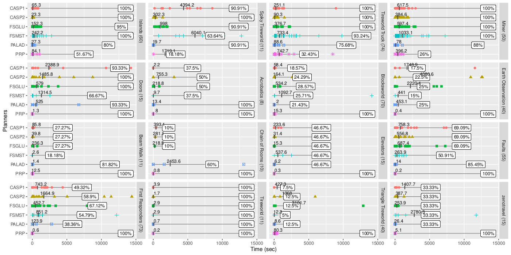

# Coverage chats in R

This R code will produce coverage & time graphs, as used in the following paper:

* Nitin Yadav, Sebastian Sardiña: [A Declarative Approach to Compact Controllers for FOND Planning via Answer Set Programming](https://ebooks.iospress.nl/doi/10.3233/FAIA230593). ECAI 2023: 2818-2825



There is one subplot per domain. Each planner shows the coverage % in the domain, and the average time on top of scatter plot of each instance.

## Setup

The script requires R.

First make sure you install R-packages [dplyr](https://dplyr.tidyverse.org/) and [ggplot2](https://ggplot2.tidyverse.org/) packages. You can do this from command line once:

```shell
$ Rscript -e 'install.packages("dplyr")'
$ Rscript -e 'install.packages("ggplot2")'
```

## Generating plots

First, prepare the CSV file; see template example in [results.csv](results.csv). 

You can change the file to read from in `plot.R` line as well as other configuration paramters under the CONSTANT section:

```R
#### SET YOUR CONSTANTS
csv_file <- "results.csv"
output_pdf <- "results.pdf"
output_png <- "results.png"
plot_width <- 15
plot_height <- 12
plot_dpi <- 300
```

Then, you can use [RStudio](https://posit.co/download/rstudio-desktop/) or simply run from command line:

```shell
$ R < plots.R --no-save
```

This should produce a PDF file and a PNG file with the plots.
